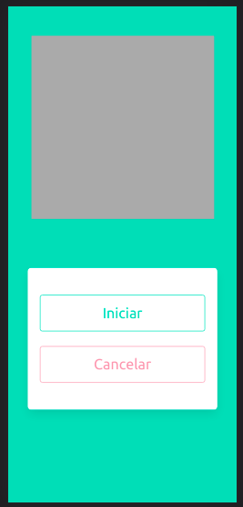

# Simulacion IoT de Semáforo

Esta es una app para simular una solución de IoT al problemas de los peatones con los semáforos en las vías publicas.

| Controlador | Semáforo |
| ----------- | -------- |
| *Aqui podemos ver la vista del control, algo simple con boton de iniciar y uno de cancelar y el area gris es donde se puede ver el contador, tambíen cuenta con un módulo de voz para las personas discapacitadas* | *Este es el semáforo simulado* |
|  |  |

